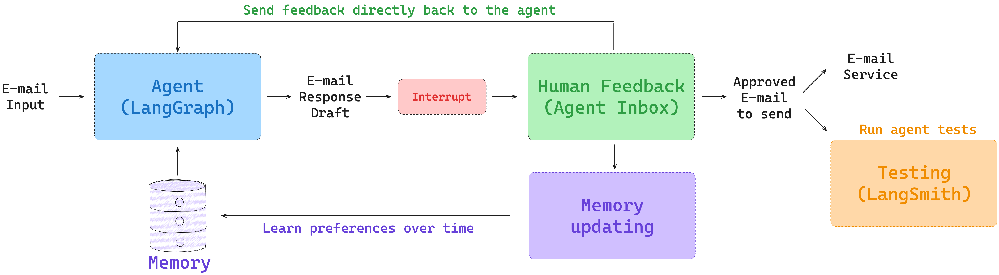
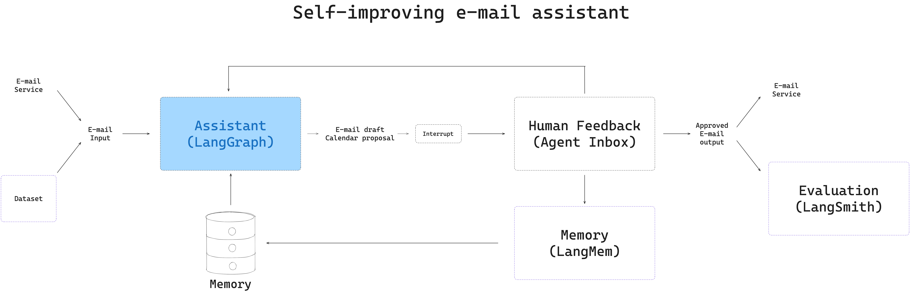
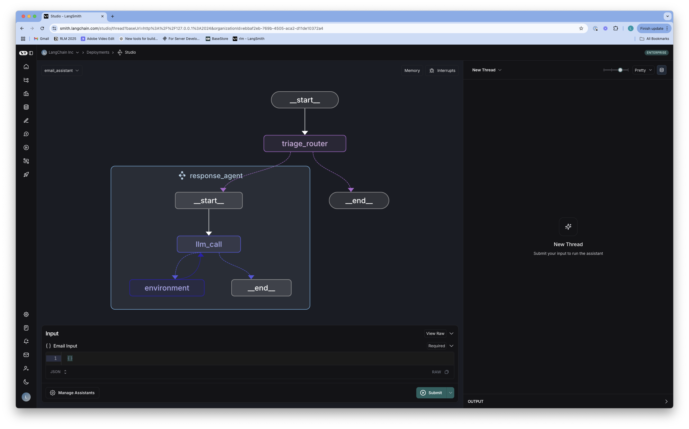
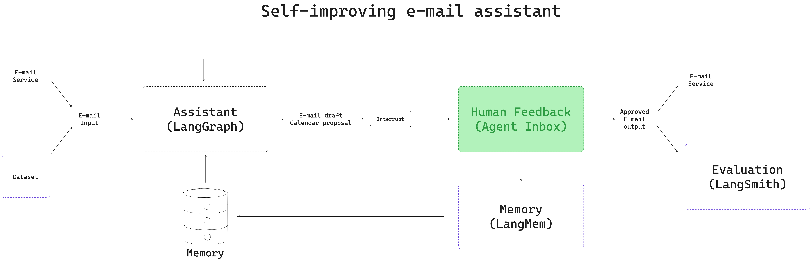
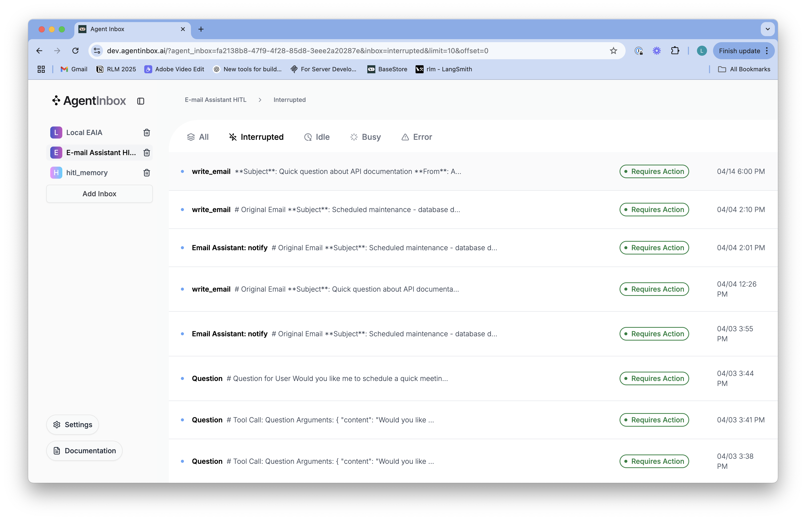

# Agents From Scratch 

AI agents promise to transform how we work, but there's often a gap between hype and reality: to act on our behalf, agents need to learn and remember our preferences. The repo is a guide to building agents from scratch, building from simple principles to self-improving and personalized agents that use LangChain, LangGraph, and LangSmith. 

We're going to build an agent that can act an an e-mail assistant, because this is often a tedious task that could benefit from an AI assistant, but it requires a high level of personalization (e.g., what to respond to, what to ignore, what to schedule a meeting for, and how to respond). The ideas and approaches shown here can be applied to other agents across a wide range of tasks. Here is a map of the components covered:



## Environment Setup 

### Python Version

* Ensure you're using Python 3.11 or later. 
* This version is required for optimal compatibility with LangGraph. 

```shell
python3 --version
```

### API Keys

* If you don't have an OpenAI API key, you can sign up [here](https://openai.com/index/openai-api/).
* Sign up for LangSmith [here](https://smith.langchain.com/).
* Generate a LangSmith API key.

### Set Environment Variables

* Create a `.env` file in the root directory:
```shell
# Copy the .env.example file to .env
cp .env.example .env
```

* Edit the `.env` file with the following:
```shell
LANGSMITH_API_KEY=your_langsmith_api_key
LANGSMITH_TRACING=true
LANGSMITH_PROJECT="interrupt-workshop"
OPENAI_API_KEY=your_openai_api_key
```

* You can also set the environment variables in your terminal:
```shell
export LANGSMITH_API_KEY=your_langsmith_api_key
export LANGSMITH_TRACING=true
export OPENAI_API_KEY=your_openai_api_key
```

### Create a virtual environment and activate it

```shell
$ python3 -m venv .venv
$ source .venv/bin/activate
# Ensure you have a recent version of pip (required for editable installs with pyproject.toml)
$ python3 -m pip install --upgrade pip
# Install the package in editable mode
$ pip install -e .
```

## Structure 

The repo is organized into the 4 sections, with a notebook for each and accompanying code in the `src/email_assistant` directory.

### Preface: LangGraph 101
For a brief introduction to LangGraph and some of the concepts used in this repo, see the [LangGraph 101 notebook](notebooks/langgraph_101.ipynb). This notebook explains the basics of chat models, tool calling, agents vs workflows, LangGraph nodes / edges / memory, and LangGraph Studio.

### Building an agent 
* Notebook: `notebooks/agent.ipynb`
* Code: `src/email_assistant/email_assistant.py`



This notebook shows how to build the email assistant, combining an [email triage step](https://langchain-ai.github.io/langgraph/tutorials/workflows/) with an agent that handles the email response. You can see the linked code for the full implementation in `src/email_assistant/email_assistant.py`.



### Evaluation 
* Notebook: `notebooks/evaluation.ipynb`


This notebook introduces evaluation with an email dataset in `eval/email_dataset.py`. It shows how to run evaluations using Pytest and the LangSmith `evaluate` API. It runs evaluation for emails responses using LLM-as-a-judge as well as evaluations for tools calls and triage decisions.


### Human-in-the-loop 
* Notebook: `notebooks/hitl.ipynb`
* Code: `src/email_assistant/email_assistant_hitl.py`



This notebooks shows how to add human-in-the-loop (HITL), allowing the user to review specific tool calls (e.g., send email, schedule meeting). For this, we use [Agent Inbox](https://github.com/langchain-ai/agent-inbox) as an interface for human in the loop. You can see the linked code for the full implementation in `src/email_assistant/email_assistant_hitl.py`.



### Memory  
* Notebook: `notebooks/memory.ipynb`
* Code: `src/email_assistant/email_assistant_hitl_memory.py`

  

This notebook shows how to add memory to the email assistant, allowing it to learn from user feedback and adapt to preferences over time. The memory-enabled assistant (`email_assistant_hitl_memory.py`) uses the [LangGraph Store](https://langchain-ai.github.io/langgraph/concepts/memory/#long-term-memory) to persist memories. You can see the linked code for the full implementation in `src/email_assistant/email_assistant_hitl_memory.py`.

## Connecting to APIs  

The above notebooks using mock email and calendar tools. 

### Gmail Integration 

Set up Google API credentials following the instructions in [Gmail Tools README](src/email_assistant/tools/gmail/README.md).

The README also explains how to deploy the graph to LangGraph Platform.

The full implementation of the Gmail integration is in `src/email_assistant/email_assistant_hitl_memory_gmail.py`.

## Future Extensions

Add [LangMem](https://langchain-ai.github.io/langmem/) to manage memories:
* Manage a collection of background memories. 
* Add memory tools that can look up facts in the background memories. 


