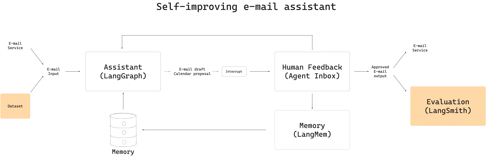
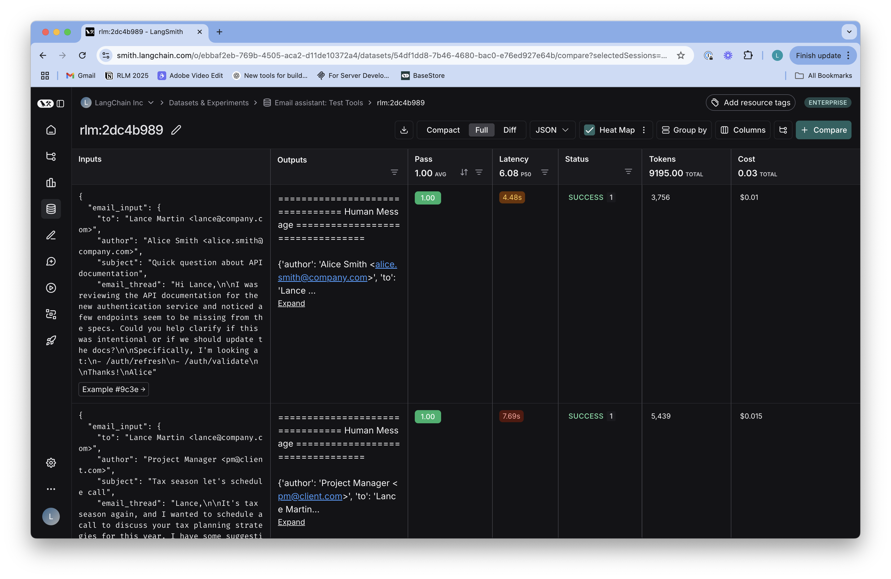
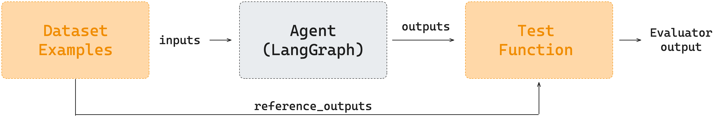
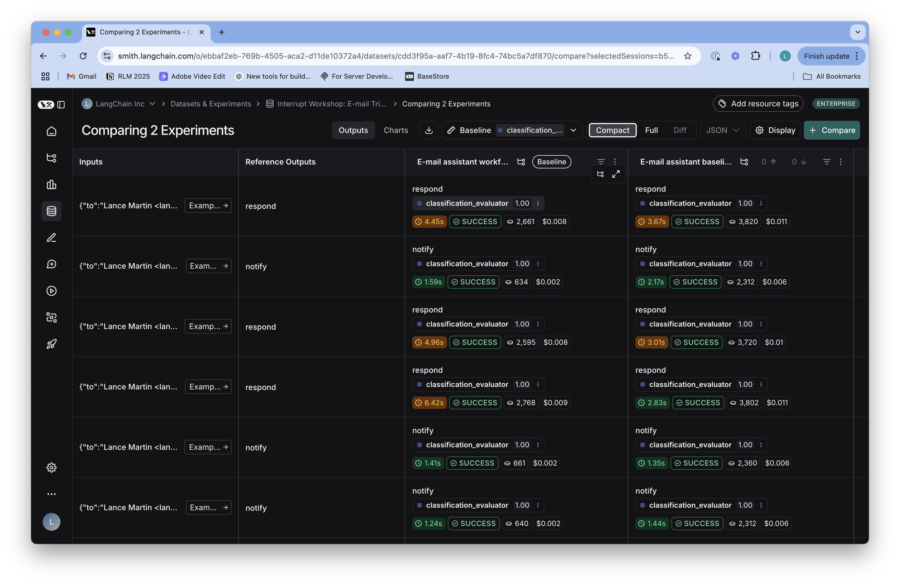

# Evaluating Agents

We have two implementations of our email assistant. One is an agent, and one is an agentic workflow that uses a router to triage the email and then passes the email to the agent for response generation. How can we compare them? As an example, we may want to know how they compare in terms of token usage, response quality, latency, or triage accuracy. This is why testing is important: it guides your decisions about architecture. [LangSmith](https://docs.smith.langchain.com/) offers two primary ways to test agents. 



## Test Approaches 

### Pytest

[Pytest](https://docs.pytest.org/en/stable/) is well known to many developers as a powerful tool for writing tests within the Python ecosystem. LangSmith integrates with pytest to allow you to write tests that we can run on each assistant and log the results to LangSmith.

### LangSmith Datasets 

You can also create a dataset [in LangSmith](https://docs.smith.langchain.com/evaluation) and run each assistant against the dataset using the LangSmith evaluate API. TODO: Add pro/con comparing Pytest to LangSmith datasets.  

## Test Cases

Testing often starts with defining the test cases, which can be a challenging process. In this case, we'll just define a set of example emails we want to handle along with a few things to test. You can see the test cases in `eval/email_dataset.py`, which contains the following:

1. **Input Emails**: A collection of diverse email examples
2. **Ground Truth Classifications**: `Respond`, `Notify`, `Ignore`
3. **Expected Tool Calls**: Tools called for each email that requires a response
4. **Response Criteria**: What makes a good response for emails requiring replies

## Pytest Example

Here's a simple example of testing using Pytest. 

```python
%cd ..
%load_ext autoreload
%autoreload 2
```

We will test whether the `baseline_agent` makes the appropriate tool calls when responding to the emails.

```python
import pytest
from eval.email_dataset import email_inputs, expected_tool_calls
from email_assistant.utils import format_messages_string
from email_assistant.baseline_agent import overall_workflow
from email_assistant.utils import extract_tool_calls

from langsmith import testing as t

@pytest.mark.langsmith
@pytest.mark.parametrize(
    "email_input, expected_calls",
    [   # Pick some examples with e-mail reply expected
        (email_inputs[0],expected_tool_calls[0]),
        (email_inputs[3],expected_tool_calls[3]),
    ],
)
def test_email_dataset_tool_calls(email_input, expected_calls):
    """Test if email processing contains expected tool calls."""
    
    # Set up the assistant
    email_assistant = overall_workflow.compile()
    
    # Run the baseline agent
    messages = [{"role": "user", "content": str(email_input)}]
    result = email_assistant.invoke({"messages": messages})
            
    # Extract tool calls from messages list
    extracted_tool_calls = extract_tool_calls(result['messages'])
            
    # Check if all expected tool calls are in the extracted ones
    missing_calls = [call for call in expected_calls if call.lower() not in extracted_tool_calls]
    
    t.log_outputs({
                "missing_calls": missing_calls,
                "extracted_tool_calls": extracted_tool_calls,
                "response": format_messages_string(result['messages'])
            })

    # Test passes if no expected calls are missing
    assert len(missing_calls) == 0
```

You'll notice a few things. First, to [run with Pytest and log test results to LangSmith](https://docs.smith.langchain.com/evaluation/how_to_guides/pytest), we only need to add the `@pytest.mark.langsmith ` decorator to our function and place it in a file, as you see in `notebooks/test_tools.py`. Second, we can pass dataset examples to the test function as shown [here](https://docs.smith.langchain.com/evaluation/how_to_guides/pytest#parametrize-with-pytestmarkparametrize) via `@pytest.mark.parametrize`. We can run the test from the command line. From the project root, run:

```
! LANGSMITH_TEST_SUITE='Email assistant: Test Tools'  pytest notebooks/test_tools.py
```

We can view the results in the LangSmith UI. The `assert len(missing_calls) == 0` is logged to the `Pass` column in LangSmith. The `log_outputs` are passed to the `Outputs` column and function arguments are passed to the `Inputs` column. Each input passed in `@pytest.mark.parametrize(` is a separate row logged to the `LANGSMITH_TEST_SUITE` project name in LangSmith, which is found under `Datasets & Experiments`.



## LangSmith Datasets 

### Dataset Definition 

In addition to the Pytest approach, we can also [create a dataset in LangSmith](https://docs.smith.langchain.com/evaluation/how_to_guides/manage_datasets_programmatically#create-a-dataset) with the LangSmith SDK. This creates a dataset with the test cases in the `eval/email_dataset.py` file.

```python
from langsmith import Client
import matplotlib.pyplot as plt

from eval.email_dataset import examples_triage
from email_assistant.email_assistant import email_assistant
from email_assistant.baseline_agent import email_assistant as baseline_agent

# Initialize LangSmith client
client = Client()

# Dataset name
dataset_name = "Interrupt Workshop: E-mail Triage Dataset"

# Create dataset if it doesn't exist
if not client.has_dataset(dataset_name=dataset_name):
    dataset = client.create_dataset(
        dataset_name=dataset_name, 
        description="A dataset of e-mails and their triage decisions."
    )
    # Add examples to the dataset
    client.create_examples(dataset_id=dataset.id, examples=examples_triage)
```

### Run Agents 

The dataset has the following structure, with an e-mail input and a ground truth classification for the e-mail as output.

```python
examples_triage = [
  {
      "inputs": {"email_input": email_input_1},
      "outputs": {"classification": triage_output_1},
  }, ...
]
```

We define functions that take dataset inputs and pass them to each agent we want to evaluate. The function just takes the `inputs` dict from the dataset and passes it to the agent. It returns a dict with the agent's output.

```python
def target_email_assistant(inputs: dict) -> dict:
    """Process an email through the workflow-based email assistant."""
    response = email_assistant.invoke({"email_input": inputs["email_input"]})
    return {"classification_decision": response['classification_decision']}

def target_email_assistant_baseline(inputs: dict) -> dict:
    """Process an email through the baseline email assistant."""
    # Format email for the baseline agent
    email_content = inputs["email_input"]
    formatted_content = f"""
From: {email_content.get('author', 'Unknown')}
To: {email_content.get('to', 'Unknown')}
Subject: {email_content.get('subject', 'No Subject')}

{email_content.get('email_thread', '')}
"""
    messages = [{"role": "user", "content": f"Please triage this email: {formatted_content}"}]
    response = baseline_agent.invoke({"messages": messages})
    return {"classification_decision": response['classification_decision']}
```

The LangSmith [evaluate API](https://docs.smith.langchain.com/evaluation) passes the `inputs` dict to this function. 

### Evaluator Function 

We also create an evaluator function. What do we want to evaluate? We have reference outputs in our dataset and agent outputs defined in the functions above.

* Reference outputs: `"outputs": {"classification": triage_output_1} ...`
* Agent outputs: `"outputs": {"classification_decision": agent_output_1} ...`

We want to evaluate if the agent's output matches the reference output. So we simply need a an evaluator function that compares the two, where `outputs` is the agent's output and `reference_outputs` is the reference output from the dataset.

```python
def classification_evaluator(outputs: dict, reference_outputs: dict) -> bool:
    """Check if the answer exactly matches the expected answer."""
    return outputs["classification_decision"].lower() == reference_outputs["classification"].lower()
```

### Running Evaluation

Now, the question is: how are these things hooked together? The evaluate API takes care of it for us. It passes the `inputs` dict from our dataset the target function. It passes the `outputs` dict from our dataset to the evaluator function. And it passes the output of our agent to the evaluator function. Note this is similar to what we did with Pytest: in Pytest, we passed in the dataset example inputs and reference outputs to the test function with `@pytest.mark.parametrize`.



```python
experiment_results_baseline = client.evaluate(
    # Run agent  
    target_email_assistant_baseline,
    # Dataset name  
    data=dataset_name,
    # Evaluator
    evaluators=[classification_evaluator],
    # Name of the experiment
    experiment_prefix="E-mail assistant baseline", 
    # Number of concurrent evaluations
    max_concurrency=2, 
)

experiment_results_workflow = client.evaluate(
    # Run agent 
    target_email_assistant,
    # Dataset name   
    data=dataset_name,
    # Evaluator
    evaluators=[classification_evaluator],
    # Name of the experiment
    experiment_prefix="E-mail assistant workflow", 
    # Number of concurrent evaluations
    max_concurrency=2, 
)
```

We can view the results from both experiments in the LangSmith UI.



### Getting Results

We can also get the results of the evaluation, which are returned as `EvaluationResult` objects and can be converted to pandas dataframes. This is great if we want to create our own visualizations to compare the performance of the two agents:

```python
# Convert evaluation results to pandas dataframes
df_baseline = experiment_results_baseline.to_pandas()
df_workflow = experiment_results_workflow.to_pandas()

# Calculate mean scores (values are on a 0-1 scale)
baseline_score = df_baseline[f'feedback.classification_evaluator'].mean()
workflow_score = df_workflow[f'feedback.classification_evaluator'].mean()

# Create a bar plot comparing the two models
plt.figure(figsize=(10, 6))
models = ['Tool Calling Agent', 'Agentic Workflow']
scores = [baseline_score, workflow_score]

# Create and save a bar chart
plt.bar(models, scores, color=['#5DA5DA', '#FAA43A'], width=0.5)
plt.xlabel('Agent Type')
plt.ylabel('Average Score')
plt.title('Email Triage Performance Comparison - Classification Score')
plt.ylim(0, 1.1)
plt.grid(axis='y', linestyle='--', alpha=0.7)
```

