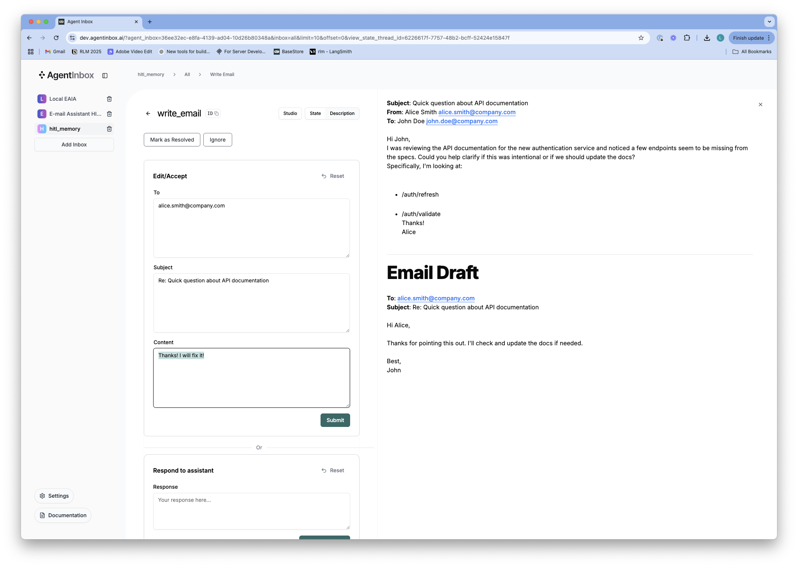
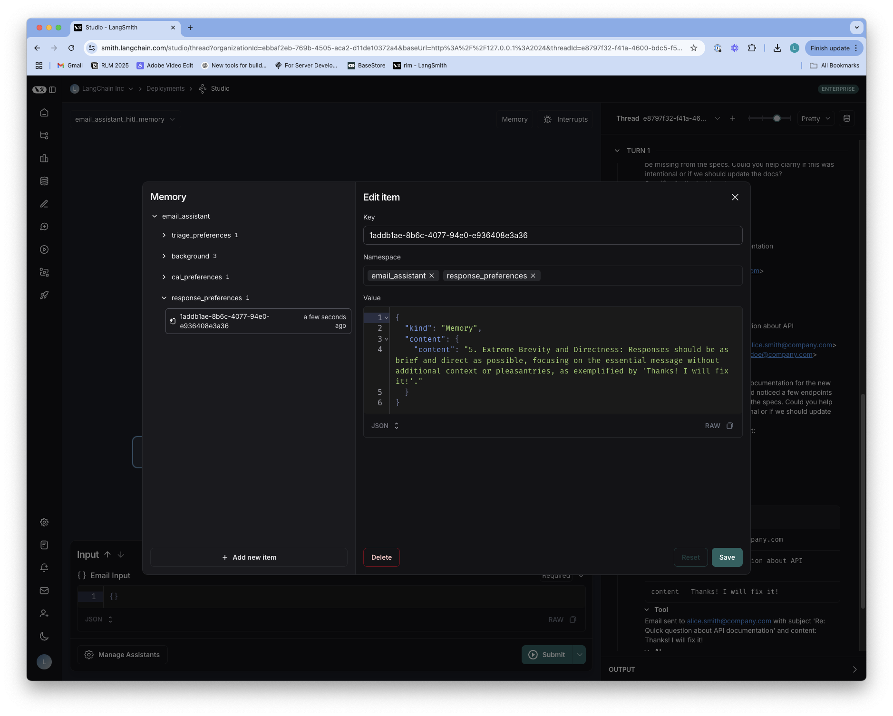

# Memory

We've used Human-in-the-Loop (HITL) to allow users to review, provide feedback on, or correct the assistant's decisions. This is great, but it would be even better if the assistant *could learn from* the user's edit / feedback and adapt to their preferences over time. This is where memory comes in. Memory is a critical and emerging component of agent systems, allowing them to learn and improve over time. In this section, we'll add memory to our email assistant, allowing it to learn from user feedback and adapt to their preferences over time. This gives us more confidence that the assistant acts on our behalf with personalization. 


## Memory in LangGraph

### Thread-Scoped and Across-Thread Memory

First, it's worth explaining how [memory works in LangGraph](https://langchain-ai.github.io/langgraph/concepts/memory/). LangGraph offers two distinct types of memory that serve complementary purposes in agent systems:

**Thread-Scoped Memory (Short-term)** operates within the boundaries of a single conversation thread. It's automatically managed as part of the graph's state and persisted through thread-scoped checkpoints. This memory type retains conversation history, uploaded files, retrieved documents, and other artifacts generated during the interaction. Think of it as the working memory that maintains context within one specific conversation, allowing the agent to reference earlier messages or actions without starting from scratch each time.

**Across-Thread Memory (Long-term)** extends beyond individual conversations, creating a persistent knowledge base that spans multiple sessions. This memory is stored as JSON documents in a memory store, organized by namespaces (like folders) and distinct keys (like filenames). Unlike thread-scoped memory, this information persists even after conversations end, enabling the system to recall user preferences, past decisions, and accumulated knowledge. This is what allows an agent to truly learn and adapt over time, rather than treating each interaction as isolated.


The [Store](https://langchain-ai.github.io/langgraph/reference/store/#langgraph.store.base.BaseStore) is the foundation of this architecture, providing a flexible database where memories can be organized, retrieved, and updated. What makes this approach powerful is that regardless of which memory type you're working with, the same Store interface provides consistent access patterns. This allows your agent's code to remain unchanged whether you're using a simple in-memory implementation during development or a production-grade database in deployment. 

### LangGraph Store

LangGraph offers different [Store implementations depending on your deployment scenario](https://langchain-ai.github.io/langgraph/reference/store/#langgraph.store.base.BaseStore):

1. **Pure In-Memory (e.g., notebooks)**:
   - Uses `from langgraph.store.memory import InMemoryStore`
   - Purely a Python dictionary in memory with no persistence
   - Data is lost when the process terminates
   - Useful for quick experiments and testing
   - Includes semantic search with cosine similarity

2. **Local Development with `langgraph dev`**:
   - Similar to InMemoryStore but with pseudo-persistence
   - Data is pickled to the local filesystem between restarts
   - Lightweight and fast, no need for external databases
   - Semantic search uses cosine similarity for embedding comparisons
   - Great for development but not designed for production use

3. **LangGraph Platform or Production Deployments**:
   - Uses PostgreSQL with pgvector for production-grade persistence
   - Fully persistent data storage with reliable backups
   - Scalable for larger datasets
   - High-performance semantic search via pgvector
   - Default distance metric is cosine similarity (customizable)

Let's use the `InMemoryStore` here in the notebook! 

```python
from langgraph.store.memory import InMemoryStore
in_memory_store = InMemoryStore()
```

Memories are namespaced by a tuple, which in this specific example will be (`<user_id>`, "memories"). The namespace can be any length and represent anything, does not have to be user specific.

```python
user_id = "1"
namespace_for_memory = (user_id, "memories")
```

We use the `store.put` method to save memories to our namespace in the store. When we do this, we specify the namespace, as defined above, and a key-value pair for the memory: the key is simply a unique identifier for the memory (memory_id) and the value (a dictionary) is the memory itself.

```python
import uuid
memory_id = str(uuid.uuid4())
memory = {"food_preference" : "I like pizza"}
in_memory_store.put(namespace_for_memory, memory_id, memory)
```

We can read out memories in our namespace using the `store.search` method, which will return all memories for a given user as a list. The most recent memory is the last in the list. Each memory type is a Python class (`Item`) with certain attributes. We can access it as a dictionary by converting via `.dict` as above. The attributes it has are shown below, but the most important ones is typically `value`.

```python
memories = in_memory_store.search(namespace_for_memory)
memories[-1].dict()
```

To use this in a graph, all we need to do is compile the graph with the store:

```
# We need this because we want to enable threads (conversations)
from langgraph.checkpoint.memory import InMemorySaver
checkpointer = InMemorySaver()
# We need this because we want to enable across-thread memory
from langgraph.store.memory import InMemoryStore
in_memory_store = InMemoryStore()
# Compile the graph with the checkpointer and store
graph = graph.compile(checkpointer=checkpointer, store=in_memory_store)
```

The store is then accessible in any node of the graph, as we'll see below!

## Memory in LangGraph

Let's take our graph used with HITL and add memory to it.

```python
%cd ..
%load_ext autoreload
%autoreload 2
```

Here we set up the triage router node, which is the first node in our graph.

```python
from typing import Literal
from pydantic import BaseModel

from langchain.chat_models import init_chat_model
from langchain_core.tools import tool

from langgraph.graph import StateGraph, START, END
from langgraph.store.base import BaseStore
from langgraph.types import interrupt, Command

from email_assistant.prompts import triage_system_prompt, triage_user_prompt, agent_system_prompt_hitl_memory, default_triage_instructions, default_background, default_response_preferences, default_cal_preferences
from email_assistant.schemas import State, RouterSchema, StateInput
from email_assistant.utils import parse_email, format_for_display, format_email_markdown, format_messages_string

# Agent tools 
@tool
def write_email(to: str, subject: str, content: str) -> str:
    """Write and send an email."""
    # Placeholder response - in real app would send email
    return f"Email sent to {to} with subject '{subject}' and content: {content}"

@tool
def schedule_meeting(
    attendees: list[str], subject: str, duration_minutes: int, preferred_day: str, start_time: int
) -> str:
    """Schedule a calendar meeting."""
    # Placeholder response - in real app would check calendar and schedule
    return f"Meeting '{subject}' scheduled on {preferred_day} at {start_time} for {duration_minutes} minutes with {len(attendees)} attendees"

@tool
def check_calendar_availability(day: str) -> str:
    """Check calendar availability for a given day."""
    # Placeholder response - in real app would check actual calendar
    return f"Available times on {day}: 9:00 AM, 2:00 PM, 4:00 PM"

@tool
class Question(BaseModel):
      """Question to ask user."""
      content: str

@tool
class Done(BaseModel):
      """E-mail has been sent."""
      done: bool
    
# All tools available to the agent
tools = [
    write_email, 
    schedule_meeting, 
    check_calendar_availability, 
    Question, 
    Done
]

tools_by_name = {tool.name: tool for tool in tools}

# Initialize the LLM for use with router / structured output
llm = init_chat_model("openai:gpt-4o", temperature=0.0)
llm_router = llm.with_structured_output(RouterSchema) 

# Initialize the LLM, enforcing tool use (of any available tools) for agent
llm = init_chat_model("openai:gpt-4o", tool_choice="required", temperature=0.0)
llm_with_tools = llm.bind_tools(tools)
```

Now, this is the critical part! We don't capture any feedback from the user in our graph. 

### Memory Management 

Let's change that by simply adding the feedback to the memory. What we *want* to do is fairly straightforward: we want to add the feedback to the memory `Store`. If we compile our graph with the store, we can access the store in any node. So that is not a problem! But we have to answer two questions: 1) how do we want the memory to be structured? 2) how do we want to update the memory? Let's create some helper functions to make this easier: we'll just store memories as string to keep things simple.

```python
def get_memory(store, namespace, default_content=None):
    """Get memory from the store or initialize with default if it doesn't exist.
    
    Args:
        store: LangGraph BaseStore instance to search for existing memory
        namespace: Tuple defining the memory namespace, e.g. ("email_assistant", "triage_preferences")
        default_content: Default content to use if memory doesn't exist
        
    Returns:
        str: The content of the memory profile, either from existing memory or the default
    """
    # Search for existing memory with namespace and key
    user_preferences = store.get(namespace, "user_preferences")
    
    # If memory exists, return its content (the value)
    if user_preferences:
        return user_preferences.value
    
    # If memory doesn't exist, add it to the store and return the default content
    else:
        # Namespace, key, value
        store.put(namespace, "user_preferences", default_content)
        user_preferences = default_content
    
    # Return the default content
    return user_preferences 

class UserPreferences(BaseModel):
    """User preferences."""
    preferences: str
    justification: str

def update_memory(store, namespace, messages):
    """Update memory profile in the store.
    
    Args:
        store: LangGraph BaseStore instance to update memory
        namespace: Tuple defining the memory namespace, e.g. ("email_assistant", "triage_preferences")
        messages: List of messages to update the memory with
    """

    # Get the existing memory
    user_preferences = store.get(namespace, "user_preferences")
    # Update the memory
    llm = init_chat_model("openai:gpt-4o", temperature=0.0).with_structured_output(UserPreferences)
    #TODO: Still see cases of memory loss. Further prompt engineering needed, and use of o-series. 
    result = llm.invoke(
        [
            {"role": "system", "content": f"You are updating user preferences for an email assistant agent. Here are the existing user preferences related to {namespace}: {user_preferences.value}"},
            {"role": "user", "content": f"Reflect carefully on the following messages. Use them to update the existing user preferences. IMPORTANT: Do NOT remove any existing preferences when updating the user preferences. Only add or make narrow modifications to the existing preferences. We want to ensure that we do not lose any information."}
        ] + messages
    )
    # Save the updated memory to the store
    store.put(namespace, "user_preferences", result.preferences)
```

The triage router now leverages stored memory to make more personalized classification decisions:

```python
# Nodes 
def triage_router(state: State, store: BaseStore) -> Command[Literal["triage_interrupt_handler", "response_agent", "__end__"]]:
    """Analyze email content to decide if we should respond, notify, or ignore.

    The triage step prevents the assistant from wasting time on:
    - Marketing emails and spam
    - Company-wide announcements
    - Messages meant for other teams
    """
    
    # Parse the email input
    author, to, subject, email_thread = parse_email(state["email_input"])
    user_prompt = triage_user_prompt.format(
        author=author, to=to, subject=subject, email_thread=email_thread
    )

    # Create email markdown for Agent Inbox in case of notification  
    email_markdown = format_email_markdown(subject, author, to, email_thread)

    # Search for existing triage_preferences memory
    triage_instructions = get_memory(store, ("email_assistant", "triage_preferences"), default_triage_instructions)

    # Format system prompt with background and triage instructions
    system_prompt = triage_system_prompt.format(
        background=default_background,
        triage_instructions=triage_instructions,
    )

    # Run the router LLM
    result = llm_router.invoke(
        [
            {"role": "system", "content": system_prompt},
            {"role": "user", "content": user_prompt},
        ]
    )

    # Decision
    classification = result.classification

    # Process the classification decision
    if classification == "respond":
        print("📧 Classification: RESPOND - This email requires a response")
        # Next node
        goto = "response_agent"
        # Update the state
        update = {
            "classification_decision": result.classification,
            "messages": [{"role": "user",
                            "content": f"Respond to the email: {email_markdown}"
                        }],
        }
        
    elif classification == "ignore":
        print("🚫 Classification: IGNORE - This email can be safely ignored")

        # Next node
        goto = END
        # Update the state
        update = {
            "classification_decision": classification,
        }

    elif classification == "notify":
        print("🔔 Classification: NOTIFY - This email contains important information") 

        # Next node
        goto = "triage_interrupt_handler"
        # Update the state
        update = {
            "classification_decision": classification,
        }

    else:
        raise ValueError(f"Invalid classification: {classification}")
    
    return Command(goto=goto, update=update)

def triage_interrupt_handler(state: State, store: BaseStore) -> Command[Literal["response_agent", "__end__"]]:
    """Handles interrupts from the triage step"""
    
    # Parse the email input
    author, to, subject, email_thread = parse_email(state["email_input"])

    # Create email markdown for Agent Inbox in case of notification  
    email_markdown = format_email_markdown(subject, author, to, email_thread)

    # Create messages
    messages = [{"role": "user",
                "content": f"Email to notify user about: {email_markdown}"
                }]

    # Create interrupt for Agent Inbox
    request = {
        "action_request": {
            "action": f"Email Assistant: {state['classification_decision']}",
            "args": {}
        },
        "config": {
            "allow_ignore": True,  
            "allow_respond": True,
            "allow_edit": False, 
            "allow_accept": False,  
        },
        # Email to show in Agent Inbox
        "description": email_markdown,
    }

    # Send to Agent Inbox and wait for response
    response = interrupt([request])[0]

    # If user provides feedback, go to response agent and use feedback to respond to email   
    if response["type"] == "response":
        # Add feedback to messages 
        user_input = response["args"]
        messages.append({"role": "user",
                        "content": f"User wants to reply to the email. Use this feedback to respond: {user_input}"
                        })
        # Update memory with feedback
        update_memory(store, ("email_assistant", "triage_preferences"), [{
            "role": "user",
            "content": f"The user decided to respond to the email, so update the triage preferences to capture this."
        }] + messages)

        goto = "response_agent"

    # If user ignores email, go to END
    elif response["type"] == "ignore":
        # Make note of the user's decision to ignore the email
        messages.append({"role": "user",
                        "content": f"The user decided to ignore the email even though it was classified as notify. Update triage preferences to capture this."
                        })
        # Update memory with feedback using the memory manager
        update_memory(store, ("email_assistant", "triage_preferences"), messages)
        goto = END

    # Catch all other responses
    else:
        raise ValueError(f"Invalid response: {response}")

    # Update the state 
    update = {
        "messages": messages,
    }

    return Command(goto=goto, update=update)
```

### Incorporating Memory into LLM Responses

Now that we have memory managers set up, we need to use the stored preferences when generating responses. The `llm_call` function demonstrates how to retrieve and incorporate memory into the LLM's context:

```python
def llm_call(state: State, store: BaseStore):
    """LLM decides whether to call a tool or not"""

    # Search for existing cal_preferences memory
    cal_preferences = get_memory(store, ("email_assistant", "cal_preferences"), default_cal_preferences)
    
    # Search for existing response_preferences memory
    response_preferences = get_memory(store, ("email_assistant", "response_preferences"), default_response_preferences)

    # Search for existing background memory
    background = get_memory(store, ("email_assistant", "background"), default_background)

    return {
        "messages": [
            llm_with_tools.invoke(
                [
                    {"role": "system", "content": agent_system_prompt_hitl_memory.format(background=background,
                                                                                         response_preferences=response_preferences, 
                                                                                         cal_preferences=cal_preferences)}
                ]
                + state["messages"]
            )
        ]
    }
```

### Memory Integration in the Interrupt Handler

The interrupt handler is where memory truly shines, as it's responsible for capturing user feedback and using it to update our various memory stores. This function showcases how we:

1. **Process User Feedback**: When a user edits an email response or provides feedback, we capture that information
2. **Update Relevant Memory**: We route the feedback to the appropriate memory manager based on the context
3. **Learn Continuously**: Each interaction becomes a learning opportunity for the system

Let's break down the key memory interactions:
    
```python
def interrupt_handler(state: State, store: BaseStore):
    """Creates an interrupt for human review of tool calls"""
    
    # Store messages
    result = []

    # Iterate over the tool calls in the last message
    for tool_call in state["messages"][-1].tool_calls:
        
        # Allowed tools for HITL
        hitl_tools = ["write_email", "schedule_meeting", "Question"]
        
        # If tool is not in our HITL list, execute it directly without interruption
        if tool_call["name"] not in hitl_tools:

            # Execute search_memory and other tools without interruption
            tool = tools_by_name[tool_call["name"]]
            observation = tool.invoke(tool_call["args"])
            result.append({"role": "tool", "content": observation, "tool_call_id": tool_call["id"]})
            continue
            
        # Get original email from email_input in state
        email_input = state["email_input"]
        author, to, subject, email_thread = parse_email(email_input)
        original_email_markdown = format_email_markdown(subject, author, to, email_thread)
        
        # Format tool call for display and prepend the original email
        tool_display = format_for_display(state, tool_call)
        description = original_email_markdown + tool_display

        # Configure what actions are allowed in Agent Inbox
        if tool_call["name"] == "write_email":
            config = {
                "allow_ignore": True,
                "allow_respond": True,
                "allow_edit": True,
                "allow_accept": True,
            }
        elif tool_call["name"] == "schedule_meeting":
            config = {
                "allow_ignore": True,
                "allow_respond": True,
                "allow_edit": True,
                "allow_accept": True,
            }
        elif tool_call["name"] == "Question":
            config = {
                "allow_ignore": True,
                "allow_respond": True,
                "allow_edit": False,
                "allow_accept": False,
            }
        else:
            raise ValueError(f"Invalid tool call: {tool_call['name']}")

        # Create the interrupt request
        request = {
            "action_request": {
                "action": tool_call["name"],
                "args": tool_call["args"]
            },
            "config": config,
            "description": description,
        }

        # Send to Agent Inbox and wait for response
        response = interrupt([request])[0]

        # Handle the responses 
        if response["type"] == "accept":

            # Execute the tool with original args
            tool = tools_by_name[tool_call["name"]]
            observation = tool.invoke(tool_call["args"])
            result.append({"role": "tool", "content": observation, "tool_call_id": tool_call["id"]})
                        
        elif response["type"] == "edit":

            # Tool selection 
            tool = tools_by_name[tool_call["name"]]
            
            # Get edited args from Agent Inbox
            edited_args = response["args"]["args"]

            # Save feedback in memory and update the write_email tool call with the edited content from Agent Inbox
            if tool_call["name"] == "write_email":

                # Capture the initial tool call
                initial_tool_call = tool_call["name"] + ": " + str(tool_call["args"])

                # Update the AI message's tool call with edited content (reference to the message in the state)
                ai_message = state["messages"][-1]
                current_id = tool_call["id"]
                
                # Replace the original tool call with the edited one (any changes made to this reference affect the original object in the state)
                ai_message.tool_calls = [tc for tc in ai_message.tool_calls if tc["id"] != current_id] + [
                    {"type": "tool_call", "name": tool_call["name"], "args": edited_args, "id": current_id}
                ]
                
                # Execute the tool with edited args
                observation = tool.invoke(edited_args)
                
                # Add only the tool response message
                result.append({"role": "tool", "content": observation, "tool_call_id": current_id})

                # We update the memory
                update_memory(store, ("email_assistant", "response_preferences"), [{
                    "role": "user",
                    "content": f"User edited the email response. Here is the initial email generated by the assistant: {initial_tool_call}. Here is the edited email: {edited_args}. Carefully examine the differences between the two. This indicates what the user modified in the email response. Update the response preferences based upon these changes so future emails generated by the assistant more closely match the user's preferences."
                }])
            
            # Save feedback in memory and update the schedule_meeting tool call with the edited content from Agent Inbox
            elif tool_call["name"] == "schedule_meeting":

                # Capture the initial tool call
                initial_tool_call = tool_call["name"] + ": " + str(tool_call["args"])

                # Update the AI message's tool call with edited content
                ai_message = state["messages"][-1]
                current_id = tool_call["id"]
                
                # Replace the original tool call with the edited one
                ai_message.tool_calls = [tc for tc in ai_message.tool_calls if tc["id"] != current_id] + [
                    {"type": "tool_call", "name": tool_call["name"], "args": edited_args, "id": current_id}
                ]
                
                # Execute the tool with edited args
                observation = tool.invoke(edited_args)
                
                # Add only the tool response message
                result.append({"role": "tool", "content": observation, "tool_call_id": current_id})

                # Update the memory
                update_memory(store, ("email_assistant", "cal_preferences"), [{
                    "role": "user",
                    "content": f"User edited the calendar invitation. Here is the initial calendar invitation generated by the assistant: {initial_tool_call}. Here is the edited calendar invitation: {edited_args}. Carefully examine the differences between the two. This indicates what the user modified in the calendar invitation. Update the cal preferences based upon these changes so future calendar invitations generated by the assistant more closely match the user's preferences."
                }])
            
            # Catch all other tool calls
            else:
                raise ValueError(f"Invalid tool call: {tool_call['name']}")

        elif response["type"] == "ignore":

            if tool_call["name"] == "write_email":
                # Don't execute the tool, and tell the agent how to proceed
                result.append({"role": "tool", "content": "User ignored this email draft. Call the 'Done' tool to end the email assistant workflow.", "tool_call_id": tool_call["id"]})
                # Update the memory by reflecting on the email tool call
                update_memory(store, ("email_assistant", "triage_preferences"), [{
                    "role": "user",
                    "content": f"The user ignored the email draft. That means they did not want to respond to the email. Update the triage preferences to ensure emails of this type are not classified as respond."
                }] + state["messages"] + result)

            elif tool_call["name"] == "schedule_meeting":
                # Don't execute the tool, and tell the agent how to proceed
                result.append({"role": "tool", "content": "User ignored this calendar meeting draft. Call the 'Done' tool to end the email assistant workflow.", "tool_call_id": tool_call["id"]})
                # Update the memory by reflecting on the full message history including the schedule_meeting tool call
                update_memory(store, ("email_assistant", "triage_preferences"), [{
                    "role": "user",
                    "content": f"The user ignored the calendar meeting draft. That means they did not want to schedule a meeting for this email. Update the triage preferences to ensure emails of this type are not classified as respond."
                }] + state["messages"] + result)

            elif tool_call["name"] == "Question":
                # Don't execute the tool, and tell the agent how to proceed
                result.append({"role": "tool", "content": "User ignored this question. Proceed with the context that you have and don't ask the user any more questions.", "tool_call_id": tool_call["id"]})
                # Update the memory by reflecting on the full message history including the Question tool call
                update_memory(store, ("email_assistant", "background"), [{
                    "role": "user",
                    "content": f"User has provided answer to a question posed by the agent. Use this to update the background information."
                }] + state["messages"] + result)

            else:
                raise ValueError(f"Invalid tool call: {tool_call['name']}")

        elif response["type"] == "response":
            # User provided feedback
            user_feedback = response["args"]
            if tool_call["name"] == "write_email":
                # Don't execute the tool, and add a message with the user feedback to incorporate into the email
                result.append({"role": "tool", "content": f"User gave feedback, which can we incorporate into the email. Feedback: {user_feedback}", "tool_call_id": tool_call["id"]})
                update_memory(store, ("email_assistant", "response_preferences"), [{
                    "role": "user",
                    "content": f"Update response preferences based upon these messages:"
                }] + state["messages"] + result)

            elif tool_call["name"] == "schedule_meeting":
                # Don't execute the tool, and add a message with the user feedback to incorporate into the email
                result.append({"role": "tool", "content": f"User gave feedback, which can we incorporate into the meeting request. Feedback: {user_feedback}", "tool_call_id": tool_call["id"]})
                update_memory(store, ("email_assistant", "cal_preferences"), [{
                    "role": "user",
                    "content": f"Update calendar preferences based upon these messages:"
                }] + state["messages"] + result)

            elif tool_call["name"] == "Question":
                # Don't execute the tool, and add a message with the user feedback to incorporate into the email
                result.append({"role": "tool", "content": f"User answered the question, which can we can use for any follow up actions. Feedback: {user_feedback}", "tool_call_id": tool_call["id"]})
                update_memory(store, ("email_assistant", "background"), [{
                    "role": "user",
                    "content": f"Update background information based upon these messages:"
                }] + state["messages"] + result)

            else:
                raise ValueError(f"Invalid tool call: {tool_call['name']}")

    return {"messages": result}
```

This is the same as before. 

```python
# Conditional edge function
def should_continue(state: State) -> Literal["interrupt_handler", END]:
    """Route to tool handler, or end if Done tool called"""
    messages = state["messages"]
    last_message = messages[-1]
    if last_message.tool_calls:
        for tool_call in last_message.tool_calls: 
            if tool_call["name"] == "Done":
                return END
            else:
                return "interrupt_handler"

# Build workflow
agent_builder = StateGraph(State)

# Add nodes - with store parameter
agent_builder.add_node("llm_call", llm_call)
agent_builder.add_node("interrupt_handler", interrupt_handler)

# Add edges
agent_builder.add_edge(START, "llm_call")
agent_builder.add_conditional_edges(
    "llm_call",
    should_continue,
    {
        "interrupt_handler": "interrupt_handler",
        END: END,
    },
)
agent_builder.add_edge("interrupt_handler", "llm_call")

# Compile the agent
response_agent = agent_builder.compile()

# Build overall workflow with store and checkpointer
overall_workflow = (
    StateGraph(State, input=StateInput)
    .add_node(triage_router)
    .add_node(triage_interrupt_handler)
    .add_node("response_agent", response_agent)
    .add_edge(START, "triage_router")
)
```

## Testing the agent with memory

Let's build a helper function to display the memory content so we can see how it changes as we run the graph.

```python
import uuid 
from langgraph.checkpoint.memory import MemorySaver
from langgraph.types import Command
from langgraph.store.memory import InMemoryStore

# Helper function to display memory content
def display_memory_content(store, namespace=None):
    # Display current memory content for all namespaces
    print("\n======= CURRENT MEMORY CONTENT =======")
    if namespace:
        memory = store.get(namespace, "user_preferences")
        if memory:
            print(f"\n--- {namespace[1]} ---")
            print({"preferences": memory.value})
        else:
            print(f"\n--- {namespace[1]} ---")
            print("No memory found")
    else:
        for namespace in [
            ("email_assistant", "triage_preferences"),
            ("email_assistant", "response_preferences"),
            ("email_assistant", "cal_preferences"),
            ("email_assistant", "background")
        ]:
            memory = store.get(namespace, "user_preferences")
            if memory:
                print(f"\n--- {namespace[1]} ---")
                print({"preferences": memory.value})
            else:
                print(f"\n--- {namespace[1]} ---")
                print("No memory found")
            print("=======================================\n")
```

## Accept `write_email` and `schedule_meeting`

This test simulates an email that gets classified as "respond" and the agent creates a schedule_meeting and write_email tool call that the user accepts.

```python
# Respond - Meeting Request Email
email_input_respond = {
    "to": "Lance Martin <lance@company.com>",
    "author": "Project Manager <pm@client.com>",
    "subject": "Tax season let's schedule call",
    "email_thread": "Lance,\n\nIt's tax season again, and I wanted to schedule a call to discuss your tax planning strategies for this year. I have some suggestions that could potentially save you money.\n\nAre you available sometime next week? Tuesday or Thursday afternoon would work best for me, for about 45 minutes.\n\nRegards,\nProject Manager"
}

# Compile the graph
checkpointer = MemorySaver()
store = InMemoryStore()
graph = overall_workflow.compile(checkpointer=checkpointer, store=store)
thread_id_1 = uuid.uuid4()
thread_config_1 = {"configurable": {"thread_id": thread_id_1}}

# Run the graph until the first interrupt 
# Email will be classified as "respond" 
# Agent will create a schedule_meeting and write_email tool call
print("Running the graph until the first interrupt...")
for chunk in graph.stream({"email_input": email_input_respond}, config=thread_config_1):
    # Inspect interrupt object if present
    if '__interrupt__' in chunk:
        Interrupt_Object = chunk['__interrupt__'][0]
        print("\nINTERRUPT OBJECT:")
        print(f"Action Request: {Interrupt_Object.value[0]['action_request']}")

# Check memory after first interrupt
display_memory_content(store)
```

Accept the schedule_meeting tool call

```python
print(f"\nSimulating user accepting the {Interrupt_Object.value[0]['action_request']['action']} tool call...")
for chunk in graph.stream(Command(resume=[{"type": "accept"}]), config=thread_config_1):
    # Inspect interrupt object if present
    if '__interrupt__' in chunk:
        Interrupt_Object = chunk['__interrupt__'][0]
        print("\nINTERRUPT OBJECT:")
        print(f"Action Request: {Interrupt_Object.value[0]['action_request']}")
```

Accept the write_email tool call

```python
print(f"\nSimulating user accepting the {Interrupt_Object.value[0]['action_request']['action']} tool call...")
for chunk in graph.stream(Command(resume=[{"type": "accept"}]), config=thread_config_1):
    # Inspect response_agent most recent message
    if 'response_agent' in chunk:
        chunk['response_agent']['messages'][-1].pretty_print()
    # Inspect interrupt object if present
    if '__interrupt__' in chunk:
        Interrupt_Object = chunk['__interrupt__'][0]
        print("\nINTERRUPT OBJECT:")
        print(f"Action Request: {Interrupt_Object.value[0]['action_request']}")

# Check memory after accepting the write_email tool call
display_memory_content(store)
```

We can look at the full messages, and the trace: 

https://smith.langchain.com/public/380f8bd8-0fc4-402f-9877-2a9f542b7024/r

You'll notice that memory is used by the LLM but *not* updated, because we haven't any feedback via HITL.

```python
state = graph.get_state(thread_config_1)
for m in state.values['messages']:
    m.pretty_print()
```

## Edit `write_email` and `schedule_meeting`

The agent creates a schedule_meeting and write_email tool call that the user edits.

```python
# Same email as before
email_input_respond = {
    "to": "Lance Martin <lance@company.com>",
    "author": "Project Manager <pm@client.com>",
    "subject": "Tax season let's schedule call",
    "email_thread": "Lance,\n\nIt's tax season again, and I wanted to schedule a call to discuss your tax planning strategies for this year. I have some suggestions that could potentially save you money.\n\nAre you available sometime next week? Tuesday or Thursday afternoon would work best for me, for about 45 minutes.\n\nRegards,\nProject Manager"
}

# Compile the graph with new thread
checkpointer = MemorySaver()
store = InMemoryStore()
graph = overall_workflow.compile(checkpointer=checkpointer, store=store)
thread_id_2 = uuid.uuid4()
thread_config_2 = {"configurable": {"thread_id": thread_id_2}}

# Run the graph until the first interrupt - will be classified as "respond" and the agent will create a write_email tool call
print("Running the graph until the first interrupt...")
for chunk in graph.stream({"email_input": email_input_respond}, config=thread_config_2):
    # Inspect interrupt object if present
    if '__interrupt__' in chunk:
        Interrupt_Object = chunk['__interrupt__'][0]
        print("\nINTERRUPT OBJECT:")
        print(f"Action Request: {Interrupt_Object.value[0]['action_request']}")

# Check memory after first interrupt
display_memory_content(store,("email_assistant", "cal_preferences"))
```

Edit the schedule_meeting tool call.

```python
# Now simulate user editing the schedule_meeting tool call
print("\nSimulating user editing the schedule_meeting tool call...")
edited_schedule_args = {
    "attendees": ["pm@client.com", "lance@company.com"],
    "subject": "Tax Planning Discussion",
    "duration_minutes": 30,  # Changed from 45 to 30
    "preferred_day": "Thursday",
    "start_time": 14  # 2pm
}
for chunk in graph.stream(Command(resume=[{"type": "edit", "args": {"args": edited_schedule_args}}]), config=thread_config_2):
    # Inspect response_agent most recent message
    if 'response_agent' in chunk:
        chunk['response_agent']['messages'][-1].pretty_print()
    # Inspect interrupt object if present
    if '__interrupt__' in chunk:
        Interrupt_Object = chunk['__interrupt__'][0]
        print("\nINTERRUPT OBJECT:")
        print(f"Action Request: {Interrupt_Object.value[0]['action_request']}")

# Check memory after editing schedule_meeting
print("\nChecking memory after editing schedule_meeting:")
display_memory_content(store,("email_assistant", "cal_preferences"))
```

Edit the write_email tool call.

```python
display_memory_content(store,("email_assistant", "response_preferences"))
# Now simulate user editing the write_email tool call
print("\nSimulating user editing the write_email tool call...")
edited_email_args = {
    "to": "pm@client.com",
    "subject": "Re: Tax season let's schedule call",
    "content": "Thanks! I scheduled a 30-minute call next Thursday at 3:00 PM. Would that work for you?\n\nBest regards,\nLance Martin"
}
for chunk in graph.stream(Command(resume=[{"type": "edit", "args": {"args": edited_email_args}}]), config=thread_config_2):
    # Inspect response_agent most recent message
    if 'response_agent' in chunk:
        chunk['response_agent']['messages'][-1].pretty_print()
    # Inspect interrupt object if present
    if '__interrupt__' in chunk:
        Interrupt_Object = chunk['__interrupt__'][0]
        print("\nINTERRUPT OBJECT:")
        print(f"Action Request: {Interrupt_Object.value[0]['action_request']}")

# Check memory after editing write_email
print("\nChecking memory after editing write_email:")
display_memory_content(store,("email_assistant", "response_preferences"))
```

Look at the full message history to see the edited tool calls: 

https://smith.langchain.com/public/084befc1-230b-4092-8673-a49e747bbeee/r

```python
state = graph.get_state(thread_config_2)
for m in state.values['messages']:
    m.pretty_print()
```

We can look specifically at the memory update:

https://smith.langchain.com/public/7acb009c-c308-4970-9bbf-5798037841c7/r

The main difference between the original and updated user preferences is the addition of a new bullet point under the "When responding to meeting scheduling requests" section:

* When proposing a meeting time, suggest a specific day, date, and time, and confirm if it works for the recipient.

This feedback was incorporated based on the user's edited email response which showed a preference for:

* Writing more concise emails
* Being specific about meeting details (day, time, duration)
* Explicitly asking for confirmation ("Would that work for you?")

## Ignore `write_email`, `schedule_meeting`, and `question`

This tests the user ignoring write_email, schedule_meeting, and question tool calls.

```python
# Respond - Meeting Request Email
email_input_respond = {
    "to": "Lance Martin <lance@company.com>",
    "author": "Project Manager <pm@client.com>",
    "subject": "Tax season let's schedule call",
    "email_thread": "Lance,\n\nIt's tax season again, and I wanted to schedule a call to discuss your tax planning strategies for this year. I have some suggestions that could potentially save you money.\n\nAre you available sometime next week? Tuesday or Thursday afternoon would work best for me, for about 45 minutes.\n\nRegards,\nProject Manager"
}

# Compile the graph
checkpointer = MemorySaver()
store = InMemoryStore()
graph = overall_workflow.compile(checkpointer=checkpointer, store=store)
thread_id_3 = uuid.uuid4()
thread_config_3 = {"configurable": {"thread_id": thread_id_3}}

# Run the graph until the first interrupt 
# Email will be classified as "respond" 
# Agent will create a schedule_meeting and write_email tool call
print("Running the graph until the first interrupt...")
for chunk in graph.stream({"email_input": email_input_respond}, config=thread_config_3):
    # Inspect interrupt object if present
    if '__interrupt__' in chunk:
        Interrupt_Object = chunk['__interrupt__'][0]
        print("\nINTERRUPT OBJECT:")
        print(f"Action Request: {Interrupt_Object.value[0]['action_request']}")

# Check memory after first interrupt
display_memory_content(store, ("email_assistant", "cal_preferences"))
```

Ignore the schedule_meeting tool call.

```python
print(f"\nSimulating user ignoring the {Interrupt_Object.value[0]['action_request']['action']} tool call...")
for chunk in graph.stream(Command(resume=[{"type": "ignore"}]), config=thread_config_3):
    # Inspect interrupt object if present
    if '__interrupt__' in chunk:
        Interrupt_Object = chunk['__interrupt__'][0]
        print("\nINTERRUPT OBJECT:")
        print(f"Action Request: {Interrupt_Object.value[0]['action_request']}")

# Check memory after ignoring first tool call
print("\nChecking memory after ignoring first tool call:")
display_memory_content(store, ("email_assistant", "triage_preferences"))
```

We can see the calendar preferences are updated based upon the fact that the user ignored the schedule_meeting tool call. TODO: Update prompt. 

https://smith.langchain.com/public/3aac63c3-325b-4585-828d-2095b0c4c461/r

Now, we ignore the write_email tool call.

```python
print(f"\nSimulating user ignoring the {Interrupt_Object.value[0]['action_request']['action']} tool call...")
for chunk in graph.stream(Command(resume=[{"type": "ignore"}]), config=thread_config_3):
    # Inspect response_agent most recent message
    if 'response_agent' in chunk:
        chunk['response_agent']['messages'][-1].pretty_print()
    # Inspect interrupt object if present
    if '__interrupt__' in chunk:
        Interrupt_Object = chunk['__interrupt__'][0]
        print("\nINTERRUPT OBJECT:")
        print(f"Action Request: {Interrupt_Object.value[0]['action_request']}")

# Check memory after ignoring second tool call
print("\nChecking memory after ignoring second tool call:")
display_memory_content(store)
```

We can see that this updates the triage preferences to reflect the fact that the user ignored the write_email tool call.

https://smith.langchain.com/public/4061e6d7-23e6-43cd-aaf1-26edd3d10d72/r

Look at the full message history.

We can see that agent does not create a meeting and does not write the email. 

```python
state = graph.get_state(thread_config_3)
for m in state.values['messages']:
    m.pretty_print()
```

Now let's try an email that calls the `Question` tool.

```python
# Respond - Meeting Request Email
email_input_respond = {
    "to": "Lance Martin <lance@company.com>",
    "author": "Partner <partner@home.com>",
    "subject": "Meet Jim and Lisa for brunch in 3 weeks?",
    "email_thread": "Hey, should we invite Jim and Lisa to brunch in 3 weeks? We could go to the new place on 17th that everyone is talking about."
}

# Compile the graph
checkpointer = MemorySaver()
store = InMemoryStore()
graph = overall_workflow.compile(checkpointer=checkpointer, store=store)
thread_id_4 = uuid.uuid4()
thread_config_4 = {"configurable": {"thread_id": thread_id_4}}

# Run the graph until the first interrupt 
# Email will be classified as "respond" 
# Agent will create a schedule_meeting and write_email tool call
print("Running the graph until the first interrupt...")
for chunk in graph.stream({"email_input": email_input_respond}, config=thread_config_4):
    # Inspect interrupt object if present
    if '__interrupt__' in chunk:
        Interrupt_Object = chunk['__interrupt__'][0]
        print("\nINTERRUPT OBJECT:")
        print(f"Action Request: {Interrupt_Object.value[0]['action_request']}")

# Check memory after first interrupt for Question tool
display_memory_content(store)
```

Ignore the question tool call.

```python
print(f"\nSimulating user ignoring the {Interrupt_Object.value[0]['action_request']['action']} tool call...")
for chunk in graph.stream(Command(resume=[{"type": "ignore"}]), config=thread_config_4):
    # Inspect interrupt object if present
    if '__interrupt__' in chunk:
        Interrupt_Object = chunk['__interrupt__'][0]
        print("\nINTERRUPT OBJECT:")
        print(f"Action Request: {Interrupt_Object.value[0]['action_request']}")

# Check memory after ignoring Question tool
print("\nChecking memory after ignoring Question tool:")
display_memory_content(store)
```

And just accept the write_email tool call.

```python
print(f"\nSimulating user accepting the {Interrupt_Object.value[0]['action_request']['action']} tool call...")
for chunk in graph.stream(Command(resume=[{"type": "accept"}]), config=thread_config_4):
    # Inspect response_agent most recent message
    if 'response_agent' in chunk:
        chunk['response_agent']['messages'][-1].pretty_print()
    # Inspect interrupt object if present
    if '__interrupt__' in chunk:
        Interrupt_Object = chunk['__interrupt__'][0]
        print("\nINTERRUPT OBJECT:")
        print(f"Action Request: {Interrupt_Object.value[0]['action_request']}")

# Check memory after accepting write_email after ignoring Question
print("\nChecking memory after accepting write_email (after ignoring Question):")
display_memory_content(store)
```

Look at the full message history.

We can see that agent does not create a meeting and does not write the email. 

```python
state = graph.get_state(thread_config_4)
for m in state.values['messages']:
    m.pretty_print()
```

## Respond (with feedback) `write_email`, `schedule_meeting`, and `question`

This tests the user responding to write_email, schedule_meeting, and question tool calls with feedback.

```python
# Respond - Meeting Request Email
email_input_respond = {
    "to": "Lance Martin <lance@company.com>",
    "author": "Project Manager <pm@client.com>",
    "subject": "Tax season let's schedule call",
    "email_thread": "Lance,\n\nIt's tax season again, and I wanted to schedule a call to discuss your tax planning strategies for this year. I have some suggestions that could potentially save you money.\n\nAre you available sometime next week? Tuesday or Thursday afternoon would work best for me, for about 45 minutes.\n\nRegards,\nProject Manager"
}

# Compile the graph
checkpointer = MemorySaver()
store = InMemoryStore()
graph = overall_workflow.compile(checkpointer=checkpointer, store=store)
thread_id_5 = uuid.uuid4()
thread_config_5 = {"configurable": {"thread_id": thread_id_5}}

# Run the graph until the first interrupt 
# Email will be classified as "respond" 
# Agent will create a schedule_meeting and write_email tool call
print("Running the graph until the first interrupt...")
for chunk in graph.stream({"email_input": email_input_respond}, config=thread_config_5):
    # Inspect interrupt object if present
    if '__interrupt__' in chunk:
        Interrupt_Object = chunk['__interrupt__'][0]
        print("\nINTERRUPT OBJECT:")
        print(f"Action Request: {Interrupt_Object.value[0]['action_request']}")

# Check memory after first interrupt 
display_memory_content(store)
```

Provide feedback for the schedule_meeting tool call.

```python
print(f"\nSimulating user providing feedback for the {Interrupt_Object.value[0]['action_request']['action']} tool call...")
for chunk in graph.stream(Command(resume=[{"type": "response", "args": "Please schedule this for 30 minutes instead of 45 minutes, and I prefer afternoon meetings after 2pm."}]), config=thread_config_5):
    # Inspect interrupt object if present
    if '__interrupt__' in chunk:
        Interrupt_Object = chunk['__interrupt__'][0]
        print("\nINTERRUPT OBJECT:")
        print(f"Action Request: {Interrupt_Object.value[0]['action_request']}")

# Check memory after providing feedback for schedule_meeting
print("\nChecking memory after providing feedback for schedule_meeting:")
display_memory_content(store)
```

Accept the schedule_meeting tool call after providing feedback.

```python
print(f"\nSimulating user accepting the {Interrupt_Object.value[0]['action_request']['action']} tool call...")
for chunk in graph.stream(Command(resume=[{"type": "accept"}]), config=thread_config_5):
    # Inspect interrupt object if present
    if '__interrupt__' in chunk:
        Interrupt_Object = chunk['__interrupt__'][0]
        print("\nINTERRUPT OBJECT:")
        print(f"Action Request: {Interrupt_Object.value[0]['action_request']}")

# Check memory after accepting schedule_meeting after feedback
print("\nChecking memory after accepting schedule_meeting after feedback:")
display_memory_content(store)
```

Now provide feedback for the write_email tool call.

```python
print(f"\nSimulating user providing feedback for the {Interrupt_Object.value[0]['action_request']['action']} tool call...")
for chunk in graph.stream(Command(resume=[{"type": "response", "args": "Shorter and less formal. Include a closing statement about looking forward to the meeting!"}]), config=thread_config_5):
    # Inspect response_agent most recent message
    if 'response_agent' in chunk:
        chunk['response_agent']['messages'][-1].pretty_print()
    # Inspect interrupt object if present
    if '__interrupt__' in chunk:
        Interrupt_Object = chunk['__interrupt__'][0]
        print("\nINTERRUPT OBJECT:")
        print(f"Action Request: {Interrupt_Object.value[0]['action_request']}")

# Check memory after providing feedback for write_email
print("\nChecking memory after providing feedback for write_email:")
display_memory_content(store)
```

Accept the write_email tool call after providing feedback.

```python
print(f"\nSimulating user accepting the {Interrupt_Object.value[0]['action_request']['action']} tool call...")
for chunk in graph.stream(Command(resume=[{"type": "accept"}]), config=thread_config_5):
    # Inspect interrupt object if present
    if '__interrupt__' in chunk:
        Interrupt_Object = chunk['__interrupt__'][0]
        print("\nINTERRUPT OBJECT:")
        print(f"Action Request: {Interrupt_Object.value[0]['action_request']}")

# Check memory after accepting write_email after feedback
print("\nChecking memory after accepting write_email after feedback:")
display_memory_content(store)
```

Look at the full message history.

```python
state = graph.get_state(thread_config_5)
for m in state.values['messages']:
    m.pretty_print()
```

Now let's try an email that calls the `Question` tool to provide feedback.

```python
# Respond - Meeting Request Email
email_input_respond = {
    "to": "Lance Martin <lance@company.com>",
    "author": "Partner <partner@home.com>",
    "subject": "Meet Jim and Lisa for brunch in 3 weeks?",
    "email_thread": "Hey, should we invite Jim and Lisa to brunch in 3 weeks? We could go to the new place on 17th that everyone is talking about."
}

# Compile the graph
checkpointer = MemorySaver()
store = InMemoryStore()
graph = overall_workflow.compile(checkpointer=checkpointer, store=store)
thread_id_6 = uuid.uuid4()
thread_config_6 = {"configurable": {"thread_id": thread_id_6}}

# Run the graph until the first interrupt
print("Running the graph until the first interrupt...")
for chunk in graph.stream({"email_input": email_input_respond}, config=thread_config_6):
    # Inspect interrupt object if present
    if '__interrupt__' in chunk:
        Interrupt_Object = chunk['__interrupt__'][0]
        print("\nINTERRUPT OBJECT:")
        print(f"Action Request: {Interrupt_Object.value[0]['action_request']}")

# Check memory after first interrupt for Question tool
display_memory_content(store)
```

Provide feedback for the Question tool call.

```python
print(f"\nSimulating user providing feedback for the {Interrupt_Object.value[0]['action_request']['action']} tool call...")
for chunk in graph.stream(Command(resume=[{"type": "response", "args": "Yes, let's invite them, I really like brunch at Jack's, ideally before 11am."}]), config=thread_config_6):
    # Inspect interrupt object if present
    if '__interrupt__' in chunk:
        Interrupt_Object = chunk['__interrupt__'][0]
        print("\nINTERRUPT OBJECT:")
        print(f"Action Request: {Interrupt_Object.value[0]['action_request']}")

# Check memory after providing feedback for Question
print("\nChecking memory after providing feedback for Question:")
display_memory_content(store)
```

Accept the write_email tool call.

```python
print(f"\nSimulating user accepting the {Interrupt_Object.value[0]['action_request']['action']} tool call...")
for chunk in graph.stream(Command(resume=[{"type": "accept"}]), config=thread_config_6):
    # Inspect response_agent most recent message
    if 'response_agent' in chunk:
        chunk['response_agent']['messages'][-1].pretty_print()
    # Inspect interrupt object if present
    if '__interrupt__' in chunk:
        Interrupt_Object = chunk['__interrupt__'][0]
        print("\nINTERRUPT OBJECT:")
        print(f"Action Request: {Interrupt_Object.value[0]['action_request']}")

# Check memory after accepting write_email after answering Question
print("\nChecking memory after accepting write_email after answering Question:")
display_memory_content(store)
```

Look at the full message history.

```python
state = graph.get_state(thread_config_6)
for m in state.values['messages']:
    m.pretty_print()
```

## Test Case for Notify Classification

This test simulates an email that gets classified as "notify" and the user decides to respond with feedback.

```python
# Notify - Important FYI Email
email_input_notify = {
    "to": "Team Members <team@company.com>",
    "author": "IT Department <it@company.com>",
    "subject": "Critical Security Update",
    "email_thread": "Dear Team,\n\nThis is an important security notification. We will be updating our authentication system this weekend. During the update window (Saturday 2am-4am), you will not be able to access company resources.\n\nPlease ensure you log out of all systems before the maintenance window.\n\nRegards,\nIT Department"
}

# Compile the graph with new thread
checkpointer = MemorySaver()
store = InMemoryStore()
graph = overall_workflow.compile(checkpointer=checkpointer, store=store)
thread_id_7 = uuid.uuid4()
thread_config_7 = {"configurable": {"thread_id": thread_id_7}}

# Run the graph until the first interrupt - should be classified as "notify"
print("Running the graph until the first interrupt...")
for chunk in graph.stream({"email_input": email_input_notify}, config=thread_config_7):
    # Inspect interrupt object if present
    if '__interrupt__' in chunk:
        Interrupt_Object = chunk['__interrupt__'][0]
        print("\nINTERRUPT OBJECT:")
        print(f"Action Request: {Interrupt_Object.value[0]['action_request']}")

# Check memory after first interrupt for Notify
display_memory_content(store)
```

Now simulate user deciding to respond with feedback.

```python
print("\nSimulating user deciding to respond with feedback...")
for chunk in graph.stream(Command(resume=[{"type": "response", "args": "We should acknowledge receipt of this important notice and confirm that we'll be logged out before the maintenance window."}]), config=thread_config_7):
    # Inspect interrupt object if present
    if '__interrupt__' in chunk:
        Interrupt_Object = chunk['__interrupt__'][0]
        print("\nINTERRUPT OBJECT:")
        print(f"Action Request: {Interrupt_Object.value[0]['action_request']}")

# Check memory after responding with feedback to Notify
print("\nChecking memory after responding with feedback to Notify:")
display_memory_content(store)
```

Accept the write_email tool call after feedback.

```python
print(f"\nSimulating user accepting the {Interrupt_Object.value[0]['action_request']['action']} tool call...")
for chunk in graph.stream(Command(resume=[{"type": "accept"}]), config=thread_config_7):
    # Inspect interrupt object if present
    if '__interrupt__' in chunk:
        Interrupt_Object = chunk['__interrupt__'][0]
        print("\nINTERRUPT OBJECT:")
        print(f"Action Request: {Interrupt_Object.value[0]['action_request']}")

# Check memory after accepting write_email for Notify
print("\nChecking memory after accepting write_email for Notify:")
display_memory_content(store)
```

Look at the full message history.

```python
state = graph.get_state(thread_config_7)
for m in state.values['messages']:
    m.pretty_print()
```

## Test Case for Notify + Ignore

This test simulates an email that gets classified as "notify" and the user decides to ignore it.

```python
# Notify - Important FYI Email
email_input_notify = {
    "to": "Team Members <team@company.com>",
    "author": "HR Department <hr@company.com>",
    "subject": "Company Picnic Next Month",
    "email_thread": "Dear Team,\n\nWe're planning the annual company picnic for next month. The tentative date is Saturday, June 15th from noon to 4pm at Central Park. There will be food, games, and activities for families.\n\nMore details will follow in the coming weeks.\n\nRegards,\nHR Department"
}

# Compile the graph with new thread
checkpointer = MemorySaver()
store = InMemoryStore()
graph = overall_workflow.compile(checkpointer=checkpointer, store=store)
thread_id_8 = uuid.uuid4()
thread_config_8 = {"configurable": {"thread_id": thread_id_8}}

# Run the graph until the first interrupt - should be classified as "notify"
print("Running the graph until the first interrupt...")
for chunk in graph.stream({"email_input": email_input_notify}, config=thread_config_8):
    # Inspect interrupt object if present
    if '__interrupt__' in chunk:
        Interrupt_Object = chunk['__interrupt__'][0]
        print("\nINTERRUPT OBJECT:")
        print(f"Action Request: {Interrupt_Object.value[0]['action_request']}")

# Check memory after first interrupt for Notify + Ignore
display_memory_content(store)
```

Now simulate user deciding to ignore the notification.

```python
print("\nSimulating user deciding to ignore the notification...")
for chunk in graph.stream(Command(resume=[{"type": "ignore"}]), config=thread_config_8):
    # Inspect interrupt object if present
    if '__interrupt__' in chunk:
        Interrupt_Object = chunk['__interrupt__'][0]
        print("\nINTERRUPT OBJECT:")
        print(f"Action Request: {Interrupt_Object.value[0]['action_request']}")

# Check memory after ignoring Notify
print("\nChecking memory after ignoring Notify:")
display_memory_content(store)
```

Look at the full message history.

```python
state = graph.get_state(thread_config_8)
for m in state.values['messages']:
    m.pretty_print()
```

## Testing with Local Deployment

You can find this graph in the `src/email_assistant` directory:

* `src/email_assistant/email_assistant_hitl_memory.py`

You can test it locally in LangGraph Studio by running:

```python
! langgraph dev
```



As you provide feedback or edit replies, you can see memories accumulate in the `memory` tab in LangGraph Studio.




